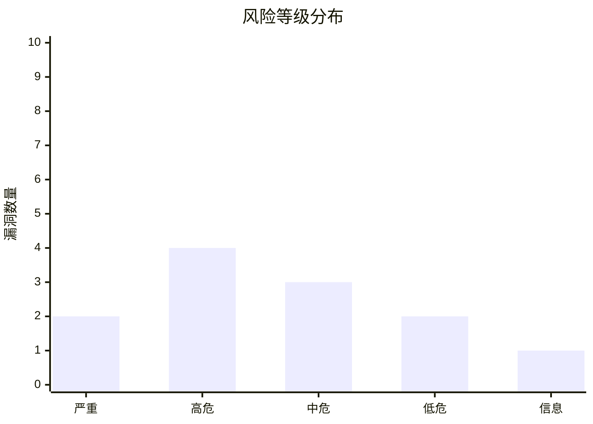
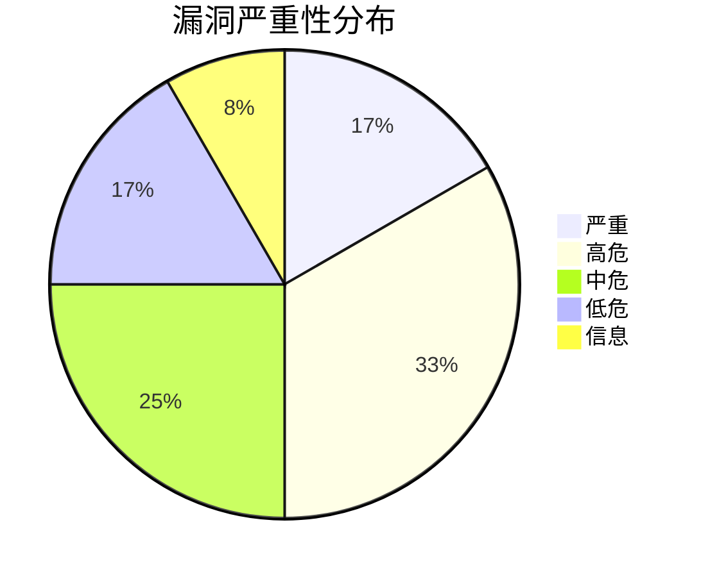
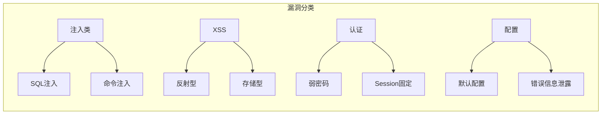

# === 原始信息（向下兼容）===
# original_title: 📄 安全报告模板 - Markdown格式 (Security Report Template - Markdown)
# original_category: 报告撰写
# original_category_en: Reporting
# original_difficulty: ★★
# original_tools: Typora, VS Code, Mermaid, Python
# original_last_updated: 2025-07
# 📄 安全报告模板 - Markdown格式 (Security Report Template - Markdown)

> **版本**: v2.0 | **更新**: 2025-Q1 | **兼容**: CVSS 3.1 / 4.0, OWASP Top 10 2021, CWE, PCI DSS, 等保2.0

## 概述

标准 Markdown 安全评估报告模板，覆盖从执行摘要到附录的完整报告结构。本模板遵循 PTES、OWASP Testing Guide 和 NIST SP 800-115 等行业标准，已优化为 AI Agent 可直接调用的结构化格式。

### 模板特性

| 特性 | 说明 |
|:---|:---|
| 📋 完整报告结构 | 文档控制 → 执行摘要 → 范围 → 发现 → 修复 → 复测 → 附录 |
| 🎨 风险可视化 | Mermaid 图表（风险分布雷达图/柱状图）、Emoji 风险等级标识 |
| 🔗 合规映射 | OWASP Top 10、CWE、PCI DSS、ISO 27001、等保2.0 |
| 🤖 AI Agent 原生支持 | 标准 JSON Schema 数据模型、Python 生成器类、批处理模式 |
| 📊 多视角统计 | 按严重性/类型/系统/OWASP分类的多维统计 |

### AI Agent 数据模型

所有模板共享统一的数据模型，便于 AI Agent 跨格式生成：

```json
{
  "report_meta": {
    "report_id": "REP-2024-001",
    "project_id": "PT-2024-001",
    "client_name": "目标公司名称",
    "project_code": "SEC-2024-001",
    "classification": "机密",
    "version": "v1.0",
    "tester": "测试人员",
    "reviewer": "审核人",
    "approver": "批准人",
    "test_start": "2024-01-01",
    "test_end": "2024-01-15",
    "report_date": "2024-01-20"
  },
  "executive_summary": {
    "overview": "本次测试概述...",
    "risk_level": "高危",
    "risk_score": 7.8,
    "total_findings": 12,
    "critical_count": 2,
    "high_count": 4,
    "medium_count": 3,
    "low_count": 2,
    "info_count": 1,
    "key_findings": [
      {"id": "F-001", "title": "关键发现1", "impact": "影响说明"},
      {"id": "F-002", "title": "关键发现2", "impact": "影响说明"}
    ]
  },
  "scope": {
    "in_scope": ["https://app.example.com", "https://api.example.com"],
    "out_of_scope": ["https://admin.example.com"],
    "targets": [
      {"url": "https://app.example.com", "type": "Web应用", "methodology": "黑盒"},
      {"url": "https://api.example.com", "type": "API", "methodology": "灰盒"}
    ]
  },
  "methodology": {
    "standards": ["PTES", "OWASP Testing Guide v4.2", "NIST SP 800-115"],
    "tools": [
      {"name": "Burp Suite", "version": "2024.x", "purpose": "Web代理/手动测试"},
      {"name": "Nuclei", "version": "3.x", "purpose": "漏洞扫描"}
    ],
    "approaches": ["黑盒测试", "白盒审计", "配置审查"]
  },
  "findings": [
    {
      "id": "VULN-001",
      "title": "SQL注入漏洞",
      "severity": "Critical",
      "cvss_score": 9.8,
      "cvss_vector": "AV:N/AC:L/PR:N/UI:N/S:U/C:H/I:H/A:H",
      "cvss_version": "3.1",
      "cve_id": "CVE-2024-XXXX",
      "cwe_id": "CWE-89",
      "owasp_category": "A03:2021 – Injection",
      "status": "open",
      "discovered_date": "2024-01-05",
      "affected_component": "登录接口 /api/v1/login",
      "vuln_type": "SQL Injection",
      "description": "登录接口username参数存在布尔盲注...",
      "reproduction_steps": [
        "访问 https://app.example.com/login",
        "在username参数注入: ' OR '1'='1' -- -",
        "系统返回管理员会话Token"
      ],
      "poc": {
        "type": "http_request",
        "content": "POST /api/v1/login HTTP/1.1\nHost: app.example.com\nContent-Type: application/json\n\n{\"username\":\"' OR '1'='1' --\",\"password\":\"test\"}"
      },
      "impact": "攻击者可绕过认证获取全部用户数据，包括密码哈希和个人信息",
      "remediation": {
        "short_term": "立即对输入参数进行参数化查询改造",
        "long_term": "引入ORM框架，实施输入验证白名单策略",
        "priority": "P0",
        "deadline": "24小时内"
      },
      "references": [
        "https://owasp.org/www-community/attacks/SQL_Injection",
        "https://cwe.mitre.org/data/definitions/89.html"
      ],
      "retest": {
        "first_round": {"date": null, "status": "pending", "note": ""},
        "second_round": {"date": null, "status": "pending", "note": ""}
      }
    }
  ],
  "compliance_mapping": {
    "pci_dss": ["6.5.1 - SQL Injection"],
    "iso_27001": ["A.14.2.1 - Secure development"],
    "等保": ["7.1.2 - 应用安全"]
  },
  "appendix": {
    "tools_detail": [],
    "raw_data_ref": "",
    "glossary": true,
    "disclaimer": true
  }
}
```

---

## Markdown 报告模板

下面是一个完整可用的 Markdown 报告模板，AI Agent 可参照此结构填充内容。

```markdown
---
title: 🛡️ 渗透测试安全评估报告
subtitle: Penetration Test Security Assessment Report
report_id: REP-2024-XXX
project_id: PT-2024-XXX
classification: 机密
version: v1.0
date: 2024-XX-XX
---

# 🛡️ 渗透测试安全评估报告

**客户名称**: [客户名称]
**测试单位**: [测试单位]
**文档密级**: 🔒 机密

---

## 📋 目录

<!-- AI Agent: 根据实际章节自动生成目录 -->

[TOC]

---

## 1. 文档控制

### 1.1 修订历史

| 版本 | 修订日期 | 修订内容 | 修订人 | 审核人 |
|:---:|:---:|:---|:---|:---:|
| v0.1 | YYYY-MM-DD | 初稿创建 | [姓名] | — |
| v0.2 | YYYY-MM-DD | 内部审核修订 | [姓名] | [姓名] |
| v1.0 | YYYY-MM-DD | 正式发布 | [姓名] | [姓名] |

### 1.2 分发范围

| 角色 | 姓名/部门 | 分发方式 | 签收日期 |
|:---|:---|:---:|:---:|
| 安全主管 | [姓名] | 加密邮件 📧 | — |
| 技术负责人 | [姓名] | 加密邮件 📧 | — |
| 法务/合规 | [部门] | 加密邮件 📧 | — |
| 项目归档 | [部门] | 内部系统 🗄️ | — |

> ⚠️ 本报告包含敏感安全信息，仅限上述分发范围。未经授权不得转发、复制或摘录。

---

## 2. 执行摘要

> **执行摘要面向管理层决策者，要求：简练（1-2页）、非技术化、突出业务影响和修复优先级。**

### 2.1 测试概况

| 项目 | 内容 |
|:---|:---|
| **客户名称** | [客户名称] |
| **测试目标** | [系统名称 / URL] |
| **测试类型** | □ 黑盒 □ 白盒 □ 灰盒 |
| **测试周期** | YYYY-MM-DD 至 YYYY-MM-DD |
| **测试人员** | [姓名] |
| **测试目标数** | [N] 个 Web应用 / API / 移动端 |

### 2.2 总体风险评估



| 风险等级 | 数量 | 占比 | 图示 |
|:---:|:---:|:---:|:---|
| 🔴 **严重 (Critical)** | [N] | [%] | ████████████ |
| 🟠 **高危 (High)** | [N] | [%] | ████████░░░░ |
| 🟡 **中危 (Medium)** | [N] | [%] | ██████░░░░░░ |
| 🔵 **低危 (Low)** | [N] | [%] | ████░░░░░░░░ |
| ⚪ **信息 (Info)** | [N] | [%] | ██░░░░░░░░░░ |
| **合计** | **[N]** | **100%** | — |

**综合风险评级**: 🔴 严重 / 🟠 高危 / 🟡 中危 / 🟢 低危

### 2.3 主要发现

| # | 漏洞编号 | 漏洞名称 | 风险等级 | 影响简述 |
|:---:|:---|:---|:---:|:---|
| 1 | **VULN-001** | [漏洞名称] | 🔴 严重 | [业务影响描述] |
| 2 | **VULN-002** | [漏洞名称] | 🟠 高危 | [业务影响描述] |
| 3 | **VULN-003** | [漏洞名称] | 🟡 中危 | [业务影响描述] |

### 2.4 关键统计数据



| 指标 | 数值 |
|:---|:---:|
| 总漏洞数 | [N] |
| 严重+高危占比 | [%] |
| 平均CVSS评分 | [X.X] |
| 预估修复周期 | [N] 天 |
| 首次复测修复率 | [%]（N/A 待复测） |

---

## 3. 测试范围与方法

### 3.1 测试范围

#### ✅ 在测范围 (In-Scope)

| 序号 | 目标 | 类型 | 测试方法 | 备注 |
|:---:|:---|:---:|:---:|:---|
| 1 | `https://app.example.com` | Web应用 | 黑盒+灰盒 | 主站 |
| 2 | `https://api.example.com/v1` | REST API | 灰盒 | 接口 |
| 3 | `https://admin.example.com` | Web管理后台 | 黑盒 | 管理端 |

#### ❌ 不在测范围 (Out-of-Scope)

| 目标 | 原因 |
|:---|:---|
| `https://partner.example.com` | 第三方合作伙伴系统 |
| [内部办公网络] | 不在此次测试授权范围 |

#### ⚠️ 测试限制

- [限制条件1：如WAF可能导致误报]
- [限制条件2：如某些功能需认证账号]
- [限制条件3：如业务高峰时段不能测试]

### 3.2 测试方法

| 阶段 | 活动描述 | 工具/技术 |
|:---:|:---|:---|
| 1. 信息收集 | 子域名枚举、端口扫描、技术栈识别 | Sublist3r, Nmap, WhatWeb |
| 2. 漏洞扫描 | 自动化漏洞扫描 + 手动验证 | Nuclei, Burp Suite, Nikto |
| 3. 手动测试 | 深度手工测试，业务逻辑测试 | Burp Suite Repeater/Intruder |
| 4. 漏洞验证 | 确认漏洞可被利用，评估影响范围 | 自定义PoC, Metasploit |
| 5. 报告编制 | 整理发现、评级、修复建议 | 本模板 |

### 3.3 遵循标准

| 标准 | 应用环节 |
|:---|:---|
| ✅ **PTES** (渗透测试执行标准) | 全流程框架 |
| ✅ **OWASP Testing Guide v4.2** | Web应用测试用例 |
| ✅ **OWASP API Security Top 10** | API安全测试 |
| ✅ **NIST SP 800-115** | 技术测试指南 |
| ✅ **CVSS 3.1 / 4.0** | 漏洞评分 |
| ✅ **CWE** / **CAPEC** | 弱点/Wiki分类 |

---

## 4. 风险分布概览

### 4.1 漏洞严重性分布

| 风险等级 | CVSS范围 | 数量 | 图示 |
|:---:|:---:|:---:|:---|
| 🔴 严重 (Critical) | 9.0 - 10.0 | [N] | ████████████████ |
| 🟠 高危 (High) | 7.0 - 8.9 | [N] | ████████████░░░░ |
| 🟡 中危 (Medium) | 4.0 - 6.9 | [N] | ████████░░░░░░░░ |
| 🔵 低危 (Low) | 0.1 - 3.9 | [N] | ████░░░░░░░░░░░░ |
| ⚪ 信息 (Info) | 0.0 | [N] | ██░░░░░░░░░░░░░░ |
| **合计** | — | **N** | **100%** |

### 4.2 漏洞类型分布

| 漏洞类型 | 数量 | 占比 |
|:---|:---:|:---:|
| SQL注入 | [N] | [%] |
| XSS跨站脚本 | [N] | [%] |
| 认证绕过 | [N] | [%] |
| 配置不当 | [N] | [%] |
| 敏感信息泄露 | [N] | [%] |
| [其他类型] | [N] | [%] |



### 4.3 受影响的系统/组件分布

| 系统/组件 | 严重 | 高危 | 中危 | 低危 | 合计 |
|:---|:---:|:---:|:---:|:---:|:---:|
| 主站 Web | [N] | [N] | [N] | [N] | [N] |
| API 接口 | [N] | [N] | [N] | [N] | [N] |
| 管理后台 | [N] | [N] | [N] | [N] | [N] |
| 移动端 | [N] | [N] | [N] | [N] | [N] |
| **合计** | **[N]** | **[N]** | **[N]** | **[N]** | **[N]** |

### 4.4 OWASP Top 10 映射

| OWASP 2021 类别 | 涉及漏洞数 | 对应 CWE |
|:---|:---:|:---|
| A01:2021 – 访问控制失效 | [N] | CWE-284, CWE-862 |
| A02:2021 – 加密机制失效 | [N] | CWE-327, CWE-310 |
| A03:2021 – 注入 | [N] | CWE-77, CWE-89 |
| A04:2021 – 不安全设计 | [N] | CWE-209 |
| A05:2021 – 安全配置错误 | [N] | CWE-16 |
| A06:2021 – 易受攻击/过时组件 | [N] | CWE-1104 |
| A07:2021 – 身份验证与识别失效 | [N] | CWE-287 |
| A08:2021 – 软件和数据完整性失效 | [N] | CWE-829 |
| A09:2021 – 安全日志和监控不足 | [N] | CWE-778 |
| A10:2021 – SSRF | [N] | CWE-918 |

---

## 5. 漏洞详情

> 每个漏洞使用以下模板，按严重性从高到低排列。

---

### 5.X 🔴 [严重] 漏洞标题

**基本信息：**

| 字段 | 值 |
|:---|:---|
| **漏洞编号** | VULN-001 |
| **CVE编号** | CVE-2024-XXXX |
| **CVSS 3.1** | 9.8 (AV:N/AC:L/PR:N/UI:N/S:U/C:H/I:H/A:H) |
| **CVSS 4.0** | 9.9 (AV:N/AC:L/PR:N/UI:P/VC:H/VI:H/VA:H/SC:N/SI:N/SA:N) |
| **风险等级** | 🔴 严重 (Critical) |
| **发现日期** | 2024-XX-XX |
| **测试人员** | [测试人员] |
| **受影响组件** | [组件名称 / 版本 / URL / 端点] |
| **漏洞类型** | SQL注入 / RCE / XSS / 认证绕过 |
| **OWASP 分类** | A03:2021 – Injection |
| **CWE 编号** | CWE-89: SQL Injection |
| **漏洞状态** | □ 未修复 □ 部分修复 ✅ 已修复 |

**漏洞描述：**

[清晰描述漏洞的原理、触发条件和潜在影响。包括：
- 漏洞位于哪个功能点/代码位置
- 漏洞触发的先决条件（是否需要认证、是否需要特定权限）
- 攻击者可以利用该漏洞做什么（业务影响视角）]

**复现步骤：**

1. 访问目标URL：`https://example.com/vuln-page`
2. 在参数 X 中注入 Payload：`[具体payload]`
3. 观察响应，确认存在漏洞的预期现象
4. 进一步利用获取更多数据/权限

**POC 请求：**

```http
POST /api/vulnerable-endpoint HTTP/1.1
Host: example.com
Content-Type: application/x-www-form-urlencoded
Cookie: session=xxx
Authorization: Bearer xxx

param1=value1&param2=[payload]
```

```bash
# 命令行 POC（可选）
curl -X POST "https://example.com/api/vulnerable-endpoint" \
  -H "Content-Type: application/x-www-form-urlencoded" \
  -d "param1=value1&param2=[payload]"
```

**POC 截图/证明：**

<!-- AI Agent: 此处可插入 Base64 编码的截图或引用附件图片 -->


**影响范围：**

| 影响类别 | 说明 | 严重程度 |
|:---|:---|:---:|
| 🔴 数据泄露 | 可获取数据库中的用户密码哈希、个人信息 | 高 |
| 🟠 权限提升 | 可获取管理员权限 | 高 |
| 🟡 横向移动 | 可访问内部网络其他系统 | 中 |

**业务影响评估：**

- **GDPR**: 涉及个人数据泄露，可能导致罚款（最高2000万欧元或全球年营收4%）
- **PCI DSS**: 违反 6.5.1 要求（SQL注入防护）
- **品牌影响**: 客户数据泄露将严重损害品牌声誉和信任度

**修复建议：**

| 优先级 | 修复措施 | 类型 | 预估工时 |
|:---:|:---|:---:|:---:|
| **P0 🔴** | 立即使用参数化查询/预编译语句替换拼接SQL | 代码修复 | 4小时 |
| **P1 🟠** | 实施输入验证白名单策略 | 代码修复 | 8小时 |
| **P2 🟡** | 引入ORM框架（如 Entity Framework / Hibernate） | 架构改进 | 1周 |
| **P2 🟡** | 部署WAF规则作为临时缓解措施 | 运维配置 | 2小时 |

**修复验证方法：**

1. 重新执行上述复现步骤，确认漏洞不再存在
2. 运行自动化扫描确认
3. 执行完整的回归测试，确保修复不影响正常功能

**参考资源：**

- [OWASP SQL Injection Prevention Cheat Sheet](https://cheatsheetseries.owasp.org/cheatsheets/SQL_Injection_Prevention_Cheat_Sheet.html)
- [CVE-2024-XXXX 详情](https://nvd.nist.gov/vuln/detail/CVE-2024-XXXX)
- [厂商安全公告](https://example.com/security-bulletin)

**复测记录：**

| 复测轮次 | 日期 | 测试人员 | 状态 | 说明 |
|:---:|:---:|:---:|:---:|:---|
| 首次复测 | YYYY-MM-DD | [姓名] | ✅ 已修复 / ⚠️ 部分修复 / ❌ 未修复 | [备注] |
| 二次复测 | YYYY-MM-DD | [姓名] | ✅ 已修复 / ⚠️ 部分修复 / ❌ 未修复 | [备注] |

---

### 5.X 🟠 [高危] 漏洞标题

<!-- 按照上述模板重复，调整风险等级颜色和图标 -->
<!-- 高危漏洞：CVSS 7.0-8.9，需在1周内修复 -->

| 字段 | 值 |
|:---|:---|
| **漏洞编号** | VULN-00X |
| **CVSS 3.1** | 8.X |
| **风险等级** | 🟠 高危 (High) |
| **修复期限** | 1周内 |

...

---

### 5.X 🟡 [中危] 漏洞标题

<!-- 中危漏洞：CVSS 4.0-6.9，需在2周内修复 -->

| 字段 | 值 |
|:---|:---|
| **漏洞编号** | VULN-00X |
| **CVSS 3.1** | 5.X |
| **风险等级** | 🟡 中危 (Medium) |
| **修复期限** | 2周内 |

...

---

### 5.X 🔵 [低危] 漏洞标题

<!-- 低危漏洞：CVSS 0.1-3.9，需在1个月内修复 -->

| 字段 | 值 |
|:---|:---|
| **漏洞编号** | VULN-00X |
| **CVSS 3.1** | 2.X |
| **风险等级** | 🔵 低危 (Low) |
| **修复期限** | 1个月内 |

...

---

### 5.X ⚪ [信息] 安全建议

<!-- 信息类发现：CVSS 0.0，无直接安全风险但建议改进 -->

| 字段 | 值 |
|:---|:---|
| **发现编号** | INFO-00X |
| **风险等级** | ⚪ 信息 (Info) |
| **类别** | 安全加固建议 |
| **修复期限** | 下一次迭代 |

...

---

## 6. 修复建议汇总

### 6.1 按优先级排序

| 优先级 | 漏洞编号 | 漏洞名称 | 风险等级 | CVSS | 修复期限 | 修复难度 |
|:---:|:---|:---|:---:|:---:|:---:|:---:|
| **P0** | VULN-001 | [漏洞名称] | 🔴 严重 | 9.8 | 24小时 | 中 |
| **P1** | VULN-002 | [漏洞名称] | 🟠 高危 | 8.5 | 1周 | 低 |
| **P2** | VULN-003 | [漏洞名称] | 🟡 中危 | 5.6 | 2周 | 高 |
| **P3** | VULN-004 | [漏洞名称] | 🔵 低危 | 3.2 | 1个月 | 低 |

**优先级定义：**

| 优先级 | 定义 | 响应要求 |
|:---:|:---|:---:|
| **P0** 🔴 | 紧急 — 可被远程利用且造成严重业务影响 | 24小时内启动修复 |
| **P1** 🟠 | 高 — 可能造成较严重的业务/数据影响 | 1周内修复 |
| **P2** 🟡 | 中 — 需一定条件才能利用 | 2周内修复 |
| **P3** 🔵 | 低 — 信息泄露或最佳实践改进 | 1个月内修复 |

### 6.2 按修复类别汇总

#### 代码层修复

| # | 修复措施 | 涉及漏洞 |
|:---:|:---|:---|
| 1 | 参数化查询 / ORM替代拼接SQL | VULN-001, VULN-005 |
| 2 | 输出编码（Context-Aware Encoding） | VULN-002 |
| 3 | 输入验证（白名单+格式校验） | VULN-001, VULN-002, VULN-003 |

#### 配置层修复

| # | 修复措施 | 涉及漏洞 |
|:---:|:---|:---|
| 1 | 禁用目录列表 | VULN-004 |
| 2 | 配置安全HTTP头（CSP, HSTS, X-Frame-Options） | VULN-006 |
| 3 | 最小权限原则（RBAC重新审计） | VULN-007 |

#### 架构层修复

| # | 修复措施 | 涉及漏洞 |
|:---:|:---|:---|
| 1 | 引入WAF（Web应用防火墙） | 多项 |
| 2 | 实施API网关统一认证与限流 | VULN-007, VULN-008 |
| 3 | 网络隔离（DMZ + 微隔离） | VULN-009 |

### 6.3 合规映射

| 合规标准 | 涉及要求 | 关联漏洞 |
|:---|:---|:---|
| **PCI DSS v4.0** | 6.5.1 SQL注入防护 | VULN-001 |
| **PCI DSS v4.0** | 6.5.2 XSS防护 | VULN-002 |
| **ISO 27001** | A.14.2.1 安全开发 | VULN-001, VULN-002 |
| **等保2.0** | 7.1.2 应用安全 | VULN-001~VULN-005 |
| **GDPR** | Art.32 安全处理 | VULN-001 (数据泄露) |

---

## 7. 复测结果

### 7.1 复测概况

| 复测轮次 | 复测日期 | 应修复数 | 已修复 | 部分修复 | 未修复 | 修复率 | 新增漏洞 | 综合状态 |
|:---:|:---:|:---:|:---:|:---:|:---:|:---:|:---:|:---:|
| 首次复测 | YYYY-MM-DD | N | N | N | N | N% | N | ⚠️ 待跟进 |
| 二次复测 | YYYY-MM-DD | N | N | N | N | N% | N | ✅ 已关闭 |

### 7.2 复测明细

| 漏洞编号 | 漏洞名称 | 原风险 | 首次复测 | 二次复测 | 剩余风险 | 最终状态 |
|:---|:---|:---:|:---:|:---:|:---:|:---:|
| VULN-001 | [名称] | 🔴 严重 | ✅ 已修复 | — | 无 | ✅ 关闭 |
| VULN-002 | [名称] | 🟠 高危 | ⚠️ 部分修复 | ✅ 已修复 | 无 | ✅ 关闭 |
| VULN-003 | [名称] | 🟡 中危 | ❌ 未修复 | ⚠️ 部分修复 | 🔵 低危 | ⚠️ 待跟进 |

### 7.3 剩余风险评估

| 漏洞编号 | 当前状态 | 剩余风险 | 接受/豁免 | 计划修复日期 |
|:---|:---|:---:|:---:|:---:|
| VULN-003 | ⚠️ 部分修复 | 🔵 低危 | — | YYYY-MM-DD |
| VULN-006 | ❌ 未修复 | 🟡 中危 | ✅ 风险已接受 | 不适用 |

---

## 8. 附录

### 附录 A：测试方法与工具详情

| 工具/技术 | 版本 | 用途 | 扫描策略 |
|:---|:---:|:---|:---|
| Burp Suite Professional | 2024.x | HTTP代理、手动测试、Intruder | 主动+被动 |
| Nuclei | 3.x | 自动化漏洞扫描 | 全模板扫描 |
| SQLMap | 1.8.x | SQL注入检测与利用 | 自动检测 |
| Nmap | 7.9x | 端口/服务发现 | SYN扫描 |
| Sublist3r | 2.x | 子域名枚举 | Passive DNS |
| WhatWeb | 0.5.x | 技术栈指纹识别 | — |
| [其他] | — | — | — |

### 附录 B：测试账号

| 角色 | 用户名 | 权限级别 | 备注 |
|:---|:---|:---:|:---|
| 普通用户 | test_user@example.com | 低 | 仅基础访问 |
| 审核员 | reviewer@example.com | 中 | 内容管理 |
| 管理员 | admin@example.com | 高 | 系统管理 |

### 附录 C：原始扫描数据摘要

<!-- AI Agent: 此处可自动插入扫描工具的原始输出摘要 -->

```json
{
  "scan_summary": {
    "total_urls_scanned": 150,
    "total_requests_made": 15000,
    "false_positives_removed": 25,
    "confirmed_vulnerabilities": 12
  }
}
```

### 附录 D：术语表

| 术语 | 全称 | 说明 |
|:---|:---|:---|
| POC | Proof of Concept | 概念验证，证明漏洞存在的代码或请求 |
| CVSS | Common Vulnerability Scoring System | 通用漏洞评分系统 |
| CVE | Common Vulnerabilities and Exposures | 通用漏洞与暴露 |
| CWE | Common Weakness Enumeration | 通用弱点枚举 |
| OWASP | Open Web Application Security Project | 开放Web应用安全项目 |
| PTES | Penetration Testing Execution Standard | 渗透测试执行标准 |
| RCE | Remote Code Execution | 远程代码执行 |
| SSRF | Server-Side Request Forgery | 服务端请求伪造 |
| XSS | Cross-Site Scripting | 跨站脚本攻击 |
| CSRF | Cross-Site Request Forgery | 跨站请求伪造 |
| IDOR | Insecure Direct Object Reference | 不安全直接对象引用 |
| MFA/2FA | Multi-Factor / Two-Factor Auth | 多因素认证 |
| WAF | Web Application Firewall | Web应用防火墙 |
| SIEM | Security Information and Event Management | 安全信息与事件管理 |
| SOC | Security Operations Center | 安全运营中心 |

### 附录 E：免责声明

> **免责声明**
>
> 1. 本报告仅对测试期间指定的范围、条件及时间节点有效，不保证覆盖所有可能的安全隐患。
> 2. 测试结果基于测试期间使用的工具和技术手段，新的攻击手法或漏洞可能不在本次测试覆盖范围内。
> 3. 修复建议仅供参考，具体实施需结合业务实际情况、系统架构和技术可行性进行评估。
> 4. 本报告包含敏感安全信息，未经授权不得向第三方披露本报告的全部或部分内容。
> 5. 测试单位对因使用本报告中的信息或建议而产生的任何直接或间接损失不承担责任。
>
> **保密声明**: 本报告为 **[客户名称]** 的机密文件，仅限授权人员阅读和使用。

---

*本报告由安全评估团队根据行业最佳实践编制，遵循 PTES、OWASP Testing Guide v4.2、NIST SP 800-115 标准。报告生成时间：YYYY-MM-DD HH:mm:ss*

*Report generated by Security Assessment Team. Standards: PTES, OWASP, NIST SP 800-115.*
```

---

## AI Agent 调用示例

```python
#!/usr/bin/env python3
"""
markdown_report_generator.py
AI Agent 调用示例：程序化生成 Markdown 安全报告

支持功能：
1. 从 JSON 数据自动填充完整报告模板
2. 多模板变体：full / executive / quick / retest
3. 自动统计生成 Mermaid 图表
4. 可导出为 .md 文件或粘贴到 Typora 等编辑器
"""

import json
import os
import datetime
from typing import List, Dict, Optional


class MarkdownReportAgent:
    """Markdown 安全报告生成器 - AI Agent 原生接口"""

    # 风险等级颜色映射
    SEVERITY_META = {
        "Critical": {"label": "严重", "icon": "🔴", "color_hex": "#DC3545"},
        "High": {"label": "高危", "icon": "🟠", "color_hex": "#FD7E14"},
        "Medium": {"label": "中危", "icon": "🟡", "color_hex": "#FFC107"},
        "Low": {"label": "低危", "icon": "🔵", "color_hex": "#0D6EFD"},
        "Info": {"label": "信息", "icon": "⚪", "color_hex": "#6C757D"},
    }

    # CVSS 等级阈值
    CVSS_SEVERITY = [
        (9.0, "Critical"),
        (7.0, "High"),
        (4.0, "Medium"),
        (0.1, "Low"),
        (0.0, "Info"),
    ]

    # 模板类型
    TEMPLATES = {
        "full": {
            "desc": "完整模板（所有章节）",
            "sections": ["cover", "toc", "control", "executive", "scope",
                         "risk_overview", "findings", "remediation", "retest", "appendix"],
        },
        "executive": {
            "desc": "执行摘要模板（仅摘要+关键数据）",
            "sections": ["cover", "executive", "risk_overview", "remediation_summary"],
        },
        "quick": {
            "desc": "快速报告（摘要+漏洞详情）",
            "sections": ["cover", "executive", "findings", "remediation_summary"],
        },
        "retest": {
            "desc": "复测报告（聚焦修复验证）",
            "sections": ["cover", "control", "executive", "retest", "appendix"],
        },
        "redteam": {
            "desc": "红队评估报告（强调攻击路径）",
            "sections": ["cover", "executive", "attack_path", "findings", "remediation", "appendix"],
        },
    }

    def __init__(self, company: str = ""):
        self.company = company or "安全评估团队"

    def _get_severity(self, cvss_score: float) -> str:
        """根据 CVSS 分数获取风险等级"""
        for threshold, severity in self.CVSS_SEVERITY:
            if cvss_score >= threshold:
                return severity
        return "Info"

    def _build_cover(self, data: Dict) -> str:
        """生成封面"""
        meta = data.get("report_meta", {})
        summary = data.get("executive_summary", {})
        today = meta.get("report_date") or datetime.date.today().strftime("%Y-%m-%d")

        lines = [
            "---",
            f"title: 🛡️ 渗透测试安全评估报告",
            f"subtitle: Penetration Test Security Assessment Report",
            f"report_id: {meta.get('report_id', 'REP-2024-XXX')}",
            f"project_id: {meta.get('project_id', 'PT-2024-XXX')}",
            f"classification: {meta.get('classification', '机密')}",
            f"version: {meta.get('version', 'v1.0')}",
            f"date: {today}",
            "---",
            "",
            "# 🛡️ 渗透测试安全评估报告",
            "",
            f"**客户名称**: {meta.get('client_name', '[客户名称]')}",
            f"**测试单位**: {self.company}",
            f"**文档密级**: 🔒 {meta.get('classification', '机密')}",
            "",
            "---",
            "",
        ]
        return "\n".join(lines)

    def _build_executive_summary(self, data: Dict) -> str:
        """生成执行摘要"""
        summary = data.get("executive_summary", {})
        meta = data.get("report_meta", {})
        total = summary.get("total_findings", 0)
        critical = summary.get("critical_count", 0)
        high = summary.get("high_count", 0)

        lines = [
            "## 2. 执行摘要",
            "",
            "### 2.1 测试概况",
            "",
            "| 项目 | 内容 |",
            "|:---|---:|",
            f"| **客户名称** | {meta.get('client_name', '[客户名称]')} |",
            f"| **测试周期** | {meta.get('test_start', 'YYYY-MM-DD')} 至 {meta.get('test_end', 'YYYY-MM-DD')} |",
            f"| **测试人员** | {meta.get('tester', '[姓名]')} |",
            f"| **测试目标数** | {len(data.get('scope', {}).get('targets', []))} 个目标 |",
            "",
            "### 2.2 总体风险评估",
            "",
            f"| 风险等级 | 数量 |",
            "|:---:|:---:|",
            f"| 🔴 严重 | {critical} |",
            f"| 🟠 高危 | {high} |",
            f"| 🟡 中危 | {summary.get('medium_count', 0)} |",
            f"| 🔵 低危 | {summary.get('low_count', 0)} |",
            f"| ⚪ 信息 | {summary.get('info_count', 0)} |",
            f"| **合计** | **{total}** |",
            "",
            f"**综合风险评级**: {summary.get('risk_level', 'N/A')}",
            "",
            "### 2.3 主要发现",
            "",
        ]

        # 关键发现列表
        key_findings = summary.get("key_findings", [])
        if key_findings:
            lines.append("| # | 发现项 | 影响说明 |")
            lines.append("|:---:|:---|:---|")
            for i, kf in enumerate(key_findings, 1):
                lines.append(f"| {i} | {kf.get('title', '')} | {kf.get('impact', '')} |")
            lines.append("")

        lines.append(
            f"**概要**: 本次测试共发现 **{total}** 个安全漏洞，"
            f"其中严重 {critical} 个，高危 {high} 个。"
        )
        lines.append("")
        lines.append("---")
        lines.append("")

        return "\n".join(lines)

    def _build_finding(self, finding: Dict, index: int) -> str:
        """生成单个漏洞详情"""
        sev = finding.get("severity", "Medium")
        meta = self.SEVERITY_META.get(sev, self.SEVERITY_META["Medium"])
        title = finding.get("title", "未命名漏洞")
        cvss = finding.get("cvss_score", "N/A")
        cvss_vec = finding.get("cvss_vector", "")
        cve = finding.get("cve_id", "N/A")
        cwe = finding.get("cwe_id", "N/A")
        owasp = finding.get("owasp_category", "N/A")
        description = finding.get("description", "")
        steps = finding.get("reproduction_steps", [])
        poc = finding.get("poc", {})
        impact = finding.get("impact", "")

        lines = [
            f"### {index}.{index} {meta['icon']} [{meta['label']}] {title}",
            "",
            "**基本信息：**",
            "",
            "| 字段 | 值 |",
            "|:---|:---|",
            f"| **漏洞编号** | {finding.get('id', 'VULN-XXX')} |",
            f"| **CVE编号** | {cve} |",
            f"| **CVSS 3.1** | {cvss} ({cvss_vec}) |",
            f"| **风险等级** | {meta['icon']} {meta['label']} |",
            f"| **发现日期** | {finding.get('discovered_date', 'YYYY-MM-DD')} |",
            f"| **受影响组件** | {finding.get('affected_component', 'N/A')} |",
            f"| **漏洞类型** | {finding.get('vuln_type', 'N/A')} |",
            f"| **OWASP 分类** | {owasp} |",
            f"| **CWE 编号** | {cwe} |",
            "",
            "**漏洞描述：**",
            "",
            description,
            "",
            "**复现步骤：**",
            "",
        ]

        for i, step in enumerate(steps, 1):
            lines.append(f"{i}. {step}")
        lines.append("")

        if poc and poc.get("content"):
            lines.extend([
                f"**POC {'请求' if poc.get('type') == 'http_request' else '代码'}：**",
                "",
                f"```{poc.get('type', 'text')}",
                poc["content"],
                "```",
                "",
            ])

        lines.extend([
            "**影响范围：**",
            "",
            impact,
            "",
            "**修复建议：**",
            "",
        ])

        remediation = finding.get("remediation", {})
        if isinstance(remediation, dict):
            lines.append(f"- **短期修复**: {remediation.get('short_term', 'N/A')}")
            lines.append(f"- **长期修复**: {remediation.get('long_term', 'N/A')}")
            lines.append(f"- **优先级**: {remediation.get('priority', 'P2')}")
            lines.append(f"- **修复期限**: {remediation.get('deadline', 'N/A')}")
        else:
            lines.append(str(remediation))

        refs = finding.get("references", [])
        if refs:
            lines.append("")
            lines.append("**参考资源：**")
            lines.append("")
            for ref in refs:
                lines.append(f"- {ref}")

        lines.extend([
            "",
            "**复测记录：**",
            "",
            "| 复测轮次 | 日期 | 状态 | 说明 |",
            "|:---:|:---:|:---:|:---|",
            "| 首次复测 | — | ⏳ 待复测 | — |",
            "| 二次复测 | — | ⏳ 待复测 | — |",
            "",
            "---",
            "",
        ])
        return "\n".join(lines)

    def build_report(self, report_data: Dict, template: str = "full") -> str:
        """
        构建完整 Markdown 报告

        参数:
            report_data: 符合标准 JSON Schema 的报告数据
            template: 模板类型（full / executive / quick / retest / redteam）

        返回:
            str: 生成的完整 Markdown 文本
        """
        sections = self.TEMPLATES.get(template, self.TEMPLATES["full"])
        parts = []

        if "cover" in sections["sections"]:
            parts.append(self._build_cover(report_data))
        if "control" in sections["sections"]:
            parts.append(
                "## 1. 文档控制\n\n"
                "### 1.1 修订历史\n\n| 版本 | 日期 | 修订内容 | 修订人 |\n|:---:|:---:|:---|:---:|\n"
                "| v1.0 | -- | 正式发布 | -- |\n\n"
            )
        if "executive" in sections["sections"]:
            parts.append(self._build_executive_summary(report_data))
        if "scope" in sections["sections"]:
            scope = report_data.get("scope", {})
            parts.append(
                "## 3. 测试范围\n\n"
                "### 在测范围\n\n"
                f"| 目标 | 类型 |\n|:---|:---:|\n"
                + "\n".join(
                    f"| {t.get('url', '')} | {t.get('type', '')} |"
                    for t in scope.get("targets", [])
                )
                + "\n\n"
            )

        # 漏洞详情
        if "findings" in sections["sections"]:
            findings = report_data.get("findings", [])
            findings_sorted = sorted(
                findings,
                key=lambda f: {"Critical": 0, "High": 1, "Medium": 2, "Low": 3, "Info": 4}.get(
                    f.get("severity", "Medium"), 99
                ),
            )

            parts.append("## 5. 漏洞详情\n\n")
            for i, finding in enumerate(findings_sorted, 1):
                parts.append(self._build_finding(finding, i))

        parts.append(
            "\n---\n\n"
            "*本报告由安全评估团队根据行业最佳实践编制。*\n\n"
            f"*报告生成时间：{datetime.datetime.now().strftime('%Y-%m-%d %H:%M:%S')}*\n"
        )

        return "\n".join(parts)

    def save_report(self, report_text: str, output_path: str):
        """保存报告到文件"""
        os.makedirs(os.path.dirname(os.path.abspath(output_path)) or ".", exist_ok=True)
        with open(output_path, "w", encoding="utf-8") as f:
            f.write(report_text)
        print(f"[+] Markdown report generated: {output_path}")

    def from_json(self, json_path: str, output_path: str = "report.md",
                   template: str = "full") -> str:
        """从 JSON 文件生成报告"""
        with open(json_path, "r", encoding="utf-8") as f:
            data = json.load(f)
        report = self.build_report(data, template=template)
        self.save_report(report, output_path)
        return output_path

    def batch_generate(self, reports_dir: str, output_dir: str = "./reports",
                        template: str = "full"):
        """批量生成报告"""
        os.makedirs(output_dir, exist_ok=True)
        for filename in os.listdir(reports_dir):
            if filename.endswith(".json"):
                input_path = os.path.join(reports_dir, filename)
                output_name = filename.replace(".json", ".md")
                output_path = os.path.join(output_dir, output_name)
                self.from_json(input_path, output_path, template=template)
                print(f"[+] Generated: {output_path}")


# ===== 快速使用 =====
if __name__ == "__main__":
    agent = MarkdownReportAgent()

    # 示例数据
    sample_data = {
        "report_meta": {
            "report_id": "REP-2024-001",
            "project_id": "PT-2024-001",
            "client_name": "示例科技有限公司",
            "classification": "机密",
            "version": "v1.0",
            "tester": "张三",
            "reviewer": "李四",
            "approver": "王五",
            "test_start": "2024-06-01",
            "test_end": "2024-06-10",
            "report_date": "2024-06-15",
        },
        "executive_summary": {
            "risk_level": "高危",
            "total_findings": 9,
            "critical_count": 1,
            "high_count": 3,
            "medium_count": 3,
            "low_count": 1,
            "info_count": 1,
            "key_findings": [
                {"title": "SQL注入漏洞", "impact": "可绕过认证获取全部用户数据"},
                {"title": "存储型XSS", "impact": "可在管理后台执行任意JS代码"},
                {"title": "IDOR越权", "impact": "可访问其他用户订单信息"},
            ],
        },
        "scope": {
            "targets": [
                {"url": "https://app.example.com", "type": "Web应用", "methodology": "黑盒"},
                {"url": "https://api.example.com/v1", "type": "REST API", "methodology": "灰盒"},
            ],
        },
        "findings": [
            {
                "id": "VULN-001",
                "title": "SQL注入漏洞 - 登录接口",
                "severity": "Critical",
                "cvss_score": 9.8,
                "cvss_vector": "AV:N/AC:L/PR:N/UI:N/S:U/C:H/I:H/A:H",
                "cve_id": "CVE-2024-XXXX",
                "cwe_id": "CWE-89",
                "owasp_category": "A03:2021 – Injection",
                "discovered_date": "2024-06-03",
                "affected_component": "/api/v1/login - username参数",
                "vuln_type": "SQL Injection",
                "description": "登录接口username参数未进行转义处理，直接拼接到SQL查询中，"
                              "导致攻击者可通过注入SQL语句绕过认证或获取数据库内容。",
                "reproduction_steps": [
                    "访问 https://app.example.com/login 页面",
                    "在username字段输入: ' OR '1'='1' -- -",
                    "在password字段输入任意值",
                    "点击登录，系统返回管理员会话Token",
                ],
                "poc": {
                    "type": "http_request",
                    "content": "POST /api/v1/login HTTP/1.1\nHost: app.example.com\n"
                               "Content-Type: application/json\n\n"
                               '{"username":"\\' OR \\'1\\'=\\'1\\' --","password":"test"}',
                },
                "impact": "攻击者可绕过认证获取全部用户数据，包括密码哈希和个人信息",
                "remediation": {
                    "short_term": "立即使用参数化查询替换字符串拼接",
                    "long_term": "引入ORM框架，实施输入验证白名单策略",
                    "priority": "P0",
                    "deadline": "24小时内",
                },
                "references": [
                    "https://owasp.org/www-community/attacks/SQL_Injection",
                    "https://cwe.mitre.org/data/definitions/89.html",
                ],
            }
        ],
    }

    # 生成报告
    report = agent.build_report(sample_data, template="full")
    agent.save_report(report, "security_report.md")
```

---

## 模板使用建议

| 场景 | 推荐模板 | 说明 | AI Agent 参数 |
|:---|:---|:---|---:|
| 🏢 完整渗透测试 | `full`（完整模板） | 覆盖所有章节，适合正式交付 | `template="full"` |
| 📊 高管汇报 | `executive`（摘要模板） | 仅含执行摘要+关键数据 | `template="executive"` |
| ⚡ 快速漏洞通告 | `quick`（快速模板） | 摘要+漏洞详情，适合紧急通报 | `template="quick"` |
| 🔄 复测报告 | `retest`（复测模板） | 聚焦修复验证状态 | `template="retest"` |
| ⚔️ 红队评估 | `redteam`（红队模板） | 强调攻击路径和TTPs | `template="redteam"` |

## AI Agent 集成要点

| 能力 | 说明 |
|:---|:---|
| **输入** | 接受标准 JSON 数据（符合上文的 JSON Schema 规范） |
| **输出** | 返回完整 Markdown 文本，可保存为 .md 文件 |
| **调用方式** | `agent.build_report(data)` → `str` |
| **批量处理** | `agent.batch_generate(input_dir, output_dir)` |
| **扩展点** | 可重写 `_build_*` 方法实现自定义章节 |
| **CI/CD 集成** | 可从自动化扫描工具的输出直接生成报告 |

## 参考资源

- [PTES Reporting Guidelines](http://www.pentest-standard.org/index.php/Reporting)
- [SANS Report Writing](https://www.sans.org/white-papers/36057/)
- [OWASP Testing Guide - Reporting](https://owasp.org/www-project-web-security-testing-guide/latest/4-Reporting)
- [CIS Benchmarks Report Templates](https://www.cisecurity.org/benchmark)
- [NIST SP 800-115](https://csrc.nist.gov/publications/detail/sp/800-115/final)
- [CVSS 4.0 Specification](https://www.first.org/cvss/v4-0/)
- [PCI DSS v4.0](https://www.pcisecuritystandards.org/document_library/)
