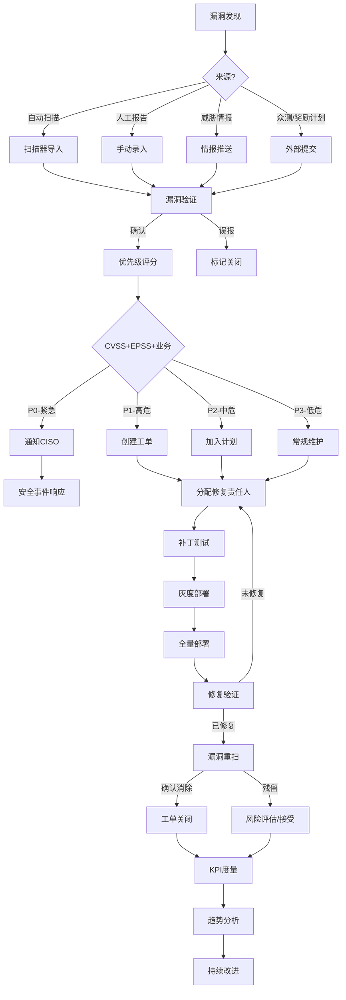

# === 原始信息（向下兼容）===
# original_title: 🔄 漏洞生命周期闭环管理 (Vulnerability Lifecycle Management)
# original_category: 漏洞管理
# original_category_en: Vulnerability Management
# original_difficulty: ★★★★
# original_tools: DefectDojo, Archer, ServiceNow, Jira Security, Kenna.VM, Vulcan, Brinqa
# original_last_updated: 2025-07
# 🔄 漏洞生命周期闭环管理 (Vulnerability Lifecycle Management)

## 概述

漏洞生命周期管理将漏洞从发现到关闭的全过程纳入可追踪、可度量的闭环体系。核心原则：**发现→评估→分配→修复→验证→关闭**，每个阶段都通过工单系统流转，确保无漏洞被遗漏。核心能力包括**工单流转、SLA管理、修复验证和度量报告**。

## 核心技能

### 1. DefectDojo 漏洞管理平台

```bash
# DefectDojo - 开源漏洞管理平台部署
# 使用Docker Compose快速部署
git clone https://github.com/DefectDojo/django-DefectDojo.git
cd django-DefectDojo
cp docker-compose.yml docker-compose.override.yml

# 启动服务
docker compose up -d

# 访问 http://localhost:8080 (默认admin/admin)

# 导入扫描结果
# 使用DefectDojo API导入（支持50+扫描器）
docker compose exec uwsgi /entrypoint.sh \
  import-scan-result \
  --product-name "Web应用" \
  --scan-type "Nuclei Scan" \
  --scan-file /results/nuclei_output.json \
  --active \
  --verified \
  --minimum-severity Medium
```

```python
#!/usr/bin/env python3
# DefectDojo API 集成 - 漏洞工单自动化

import requests
import json
from datetime import datetime

class DefectDojoClient:
    def __init__(self, base_url, api_key):
        self.base = base_url.rstrip('/')
        self.headers = {
            "Authorization": f"Token {api_key}",
            "Content-Type": "application/json"
        }
    
    def get_engagements(self, active_only=True):
        """获取活跃测试任务"""
        params = {"active": str(active_only).lower()}
        resp = requests.get(f"{self.base}/api/v2/engagements/",
                           params=params, headers=self.headers)
        return resp.json().get('results', [])
    
    def create_finding(self, product_id, title, cve_id, severity, description, mitigation):
        """创建漏洞记录"""
        finding = {
            "product": product_id,
            "title": title,
            "cve": cve_id,
            "severity": severity,
            "description": description,
            "mitigation": mitigation,
            "impact": "漏洞可能导致未经授权的访问",
            "active": True,
            "verified": True,
            "date": datetime.now().strftime("%Y-%m-%d"),
            "numerical_severity": severity
        }
        
        resp = requests.post(f"{self.base}/api/v2/findings/",
                           json=finding, headers=self.headers)
        return resp.json() if resp.status_code == 201 else resp.text
    
    def update_finding_status(self, finding_id, status):
        """更新漏洞状态 (active/verified/false_p/mitigated)"""
        data = {"active": False, "is_mitigated": True, "mitigated": datetime.now().isoformat()} \
               if status == "mitigated" else {"active": True, "verified": True}
        
        resp = requests.patch(f"{self.base}/api/v2/findings/{finding_id}/",
                            json=data, headers=self.headers)
        return resp.json()
    
    def get_open_findings(self, severity=None, product_id=None):
        """获取待处理漏洞"""
        params = {"active": "true", "verified": "true", "limit": 100}
        if severity:
            params["severity"] = severity
        if product_id:
            params["product"] = product_id
        
        resp = requests.get(f"{self.base}/api/v2/findings/",
                           params=params, headers=self.headers)
        findings = resp.json().get('results', [])
        
        summary = {"total": len(findings),
                   "critical": sum(1 for f in findings if f['severity'] == 'Critical'),
                   "high": sum(1 for f in findings if f['severity'] == 'High'),
                   "medium": sum(1 for f in findings if f['severity'] == 'Medium'),
                   "low": sum(1 for f in findings if f['severity'] == 'Low')}
        return findings, summary
    
    def generate_report(self):
        """生成漏洞管理报告"""
        findings, summary = self.get_open_findings()
        return {
            "report_date": datetime.now().isoformat(),
            "summary": summary,
            "aging_analysis": self._aging_analysis(findings),
            "remediation_progress": self._remediation_trend()
        }
    
    def _aging_analysis(self, findings):
        """漏洞账龄分析"""
        aging = {"0-7天": 0, "7-30天": 0, "30-90天": 0, "90天+": 0}
        for f in findings:
            created = datetime.fromisoformat(f.get('date', datetime.now().isoformat()[:10]))
            days = (datetime.now() - created).days
            if days <= 7: aging["0-7天"] += 1
            elif days <= 30: aging["7-30天"] += 1
            elif days <= 90: aging["30-90天"] += 1
            else: aging["90天+"] += 1
        return aging
    
    def _remediation_trend(self):
        """修复趋势（最近30天）"""
        from collections import Counter
        import datetime as dt
        
        dates = []
        for day_offset in range(30):
            day = (dt.datetime.now() - dt.timedelta(days=day_offset)).strftime("%Y-%m-%d")
            params = {"is_mitigated": "true", "mitigated": day, "limit": 1}
            resp = requests.get(f"{self.base}/api/v2/findings/",
                              params=params, headers=self.headers)
            total = resp.json().get('count', 0)
            if total > 0:
                dates.append((day, total))
        return dates[:14]

# 使用示例
client = DefectDojoClient("http://localhost:8080", "your-api-key-here")
report = client.generate_report()
print(json.dumps(report, indent=2, ensure_ascii=False))
```

### 2. Jira 漏洞工单自动化

```python
#!/usr/bin/env python3
# Jira漏洞工单自动化流转

from jira import JIRA
import re

class VulnerabilityTicketManager:
    """漏洞工单管理"""
    
    PRIORITY_MAP = {
        'CRITICAL': 'Blocker',
        'HIGH': 'Critical',
        'MEDIUM': 'Major',
        'LOW': 'Minor',
        'INFO': 'Trivial'
    }
    
    def __init__(self, jira_url, username, api_token, project_key):
        self.jira = JIRA(server=jira_url, basic_auth=(username, api_token))
        self.project_key = project_key
    
    def create_ticket(self, vuln, assignee=None):
        """创建漏洞工单"""
        # 从CVE获取描述
        description = self._format_description(vuln)
        
        issue_dict = {
            'project': {'key': self.project_key},
            'summary': f"[漏洞] {vuln.get('severity')} — {vuln.get('title', vuln.get('cve_id'))}",
            'description': description,
            'issuetype': {'name': 'Bug'},
            'priority': {'name': self.PRIORITY_MAP.get(vuln.get('severity', 'MEDIUM'), 'Major')},
            'labels': ['vulnerability', 'security', vuln.get('severity', '').lower()],
            'customfield_12345': vuln.get('cvss', 0),  # CVSS评分字段
            'duedate': self._calculate_due_date(vuln.get('severity', 'MEDIUM'))
        }
        
        if assignee:
            issue_dict['assignee'] = {'name': assignee}
        
        new_issue = self.jira.create_issue(fields=issue_dict)
        
        # 添加自定义字段 - 漏洞详情链接
        if vuln.get('cve_id'):
            self.jira.add_simple_link(new_issue, object={
                'url': f"https://nvd.nist.gov/vuln/detail/{vuln['cve_id']}",
                'title': f"NVD: {vuln['cve_id']}"
            })
        
        return new_issue.key
    
    def _format_description(self, vuln):
        """格式化漏洞描述"""
        lines = [
            "h3. 漏洞详情",
            f"*CVE ID*: {vuln.get('cve_id', 'N/A')}",
            f"*CVSS评分*: {vuln.get('cvss', 'N/A')}",
            f"*EPSS评分*: {vuln.get('epss', 'N/A')}",
            f"*受影响资产*: {vuln.get('asset', 'N/A')}",
            f"*漏洞类型*: {vuln.get('vuln_type', 'N/A')}",
            "",
            "h3. 描述",
            vuln.get('description', '请补充漏洞描述'),
            "",
            "h3. 修复建议",
            vuln.get('remediation', '请参考NVD或供应商安全公告'),
            "",
            "h3. 参考链接",
            f"* NVD: https://nvd.nist.gov/vuln/detail/{vuln.get('cve_id', '')}",
            f"* CVE: https://www.cve.org/CVERecord?id={vuln.get('cve_id', '')}"
        ]
        return "\n".join(lines)
    
    def _calculate_due_date(self, severity):
        """计算到期日期"""
        from datetime import datetime, timedelta
        slas = {'CRITICAL': 1, 'HIGH': 3, 'MEDIUM': 14, 'LOW': 30, 'INFO': 90}
        days = slas.get(severity, 14)
        return (datetime.now() + timedelta(days=days)).strftime("%Y-%m-%d")
    
    def transition_to_review(self, issue_key):
        """工单流转到修复验证阶段"""
        transitions = self.jira.transitions(issue_key)
        for t in transitions:
            if 'review' in t['name'].lower() or 'verify' in t['name'].lower():
                self.jira.transition_issue(issue_key, t['id'])
                return True
        return False
    
    def close_ticket(self, issue_key, resolution='Fixed'):
        """关闭已修复工单"""
        transitions = self.jira.transitions(issue_key)
        close_transition = None
        resolve_transition = None
        
        for t in transitions:
            if t['name'].lower() == 'close':
                close_transition = t['id']
            if t['name'].lower() == 'resolve':
                resolve_transition = t['id']
        
        if resolve_transition:
            self.jira.transition_issue(issue_key, resolve_transition)
        if close_transition:
            self.jira.transition_issue(issue_key, close_transition)
        
        return True

# 使用示例
ticket_mgr = VulnerabilityTicketManager(
    jira_url="https://your-domain.atlassian.net",
    username="your-email@company.com",
    api_token="your-api-token",
    project_key="SEC"
)

vuln_info = {
    'cve_id': 'CVE-2024-12345',
    'cvss': 9.8,
    'severity': 'CRITICAL',
    'title': '远程代码执行漏洞',
    'asset': 'web-server-01.prod',
    'description': 'Web应用存在未经身份验证的远程代码执行漏洞',
    'remediation': '升级到版本2.1.0以上'
}
ticket_key = ticket_mgr.create_ticket(vuln_info, assignee="security-team")
print(f"工单已创建: {ticket_key}")
```

### 3. 漏洞SLA管理

```python
#!/usr/bin/env python3
# 漏洞SLA管理与告警

from datetime import datetime, timedelta
import json

class SLAManager:
    """SLA合规管理"""
    
    SLA_DEFINITIONS = {
        'CRITICAL': {'resolve_hours': 24, 'response_hours': 2},
        'HIGH': {'resolve_hours': 72, 'response_hours': 8},
        'MEDIUM': {'resolve_hours': 336, 'response_hours': 24},   # 14天
        'LOW': {'resolve_hours': 720, 'response_hours': 48},       # 30天
        'INFO': {'resolve_hours': 2160, 'response_hours': 72}      # 90天
    }
    
    def __init__(self):
        self.violations = []
    
    def check_sla(self, vuln):
        """检查SLA合规性"""
        severity = vuln.get('severity', 'MEDIUM').upper()
        sla = self.SLA_DEFINITIONS.get(severity, self.SLA_DEFINITIONS['MEDIUM'])
        
        discovered = datetime.fromisoformat(vuln.get('discovered_date'))
        now = datetime.now()
        elapsed_hours = (now - discovered).total_seconds() / 3600
        
        # 响应SLA
        if 'response_time' not in vuln:
            responded = elapsed_hours <= sla['response_hours']
        else:
            responded = True
        
        # 修复SLA
        needs_resolve = elapsed_hours <= sla['resolve_hours']
        
        status = {
            'cve_id': vuln.get('cve_id'),
            'severity': severity,
            'elapsed_hours': round(elapsed_hours, 1),
            'response_sla_hours': sla['response_hours'],
            'resolve_sla_hours': sla['resolve_hours'],
            'response_compliant': responded,
            'resolve_compliant': needs_resolve or vuln.get('is_mitigated', False),
            'deadline': (discovered + timedelta(hours=sla['resolve_hours'])).isoformat()
        }
        
        if not status['resolve_compliant']:
            self.violations.append(status)
            status['alert'] = f"⚠️ SLA违规: {vuln['cve_id']} 已超过修复期限 " \
                              f"({elapsed_hours:.0f}h / {sla['resolve_hours']}h)"
        
        return status
    
    def sla_summary(self):
        """SLA状态摘要"""
        compliant = len([v for v in self.violations if v.get('resolve_compliant')])
        non_compliant = len(self.violations) - compliant
        
        return {
            'total_violations': len(self.violations),
            'compliant': compliant,
            'non_compliant': non_compliant,
            'sla_compliance_rate': f"{compliant / max(len(self.violations), 1) * 100:.1f}%",
            'urgent_violations': [v for v in self.violations 
                                  if v['severity'] in ['CRITICAL', 'HIGH'] and not v['resolve_compliant']]
        }

# 使用示例
sla = SLAManager()
findings = [
    {'cve_id': 'CVE-2024-001', 'severity': 'CRITICAL', 'discovered_date': '2025-07-10T08:00:00'},
    {'cve_id': 'CVE-2024-002', 'severity': 'HIGH', 'discovered_date': '2025-07-01T10:00:00'},
]
for f in findings:
    status = sla.check_sla(f)
    if 'alert' in status:
        print(status['alert'])
print(json.dumps(sla.sla_summary(), indent=2, ensure_ascii=False))
```

### 4. 修复验证闭环

```yaml
# 修复验证闭环流程
remediation_verification_loop:
  step_1_remediation:
    owner: "基础设施团队"
    action: "部署补丁或应用缓解措施"
    evidence: "部署日志、配置变更记录"
  
  step_2_self_verify:
    owner: "修复执行人"
    action: "自我验证修复效果"
    check:
      - "确认补丁版本: rpm -q patch-package"
      - "服务正常运行: systemctl status service"
      - "功能正常: curl -I https://host/health"
    output: "自检通过报告"
  
  step_3_scan_verify:
    owner: "安全团队"
    action: "重新扫描确认漏洞消除"
    tool: "Nuclei / Nessus / 专用验证扫描"
    criteria: 
      - "原CVE/模板不再匹配"
      - "针对性扫描返回clean"
    output: "扫描验证报告"
  
  step_4_risk_acceptance:
    owner: "安全架构师"
    action: "确认修复完成的合规性"
    exceptions:
      - "无法修复: 需提交风险接受声明"
      - "部分修复: 需提交补偿控制说明"
    output: "签字确认"
  
  step_5_close:
    owner: "漏洞管理平台"
    action: "自动更新工单状态"
    updates:
      - "状态: 已关闭"
      - "修复日期: YYYY-MM-DD"
      - "解决方案: 补丁/配置变更/缓解措施"
      - "验证人: security-team"
    output: "工单关闭 + KPI记录"

# 修复验证报告模板
verification_report_template:
  metadata:
    report_id: "VR-2025-07-001"
    vuln_id: "CVE-2024-12345"
    scanner_id: "Nuclei-CVE-2024-12345"
  pre_remediation:
    scan_date: "2025-07-10T08:00:00Z"
    status: "VULNERABLE"
    evidence: "nuclei_pre_scan.json"
  remediation:
    applied_by: "infra-team"
    date: "2025-07-11T02:00:00Z"
    type: "vendor_patch"
    version_after: "2.1.1"
  post_remediation:
    scan_date: "2025-07-11T03:00:00Z"
    status: "NOT_VULNERABLE"
    scanner_exit_code: 0
    evidence: "nuclei_post_scan.json"
  result: "FIXED"
```

### 5. 漏洞度量仪表板

```python
#!/usr/bin/env python3
# 漏洞管理仪表板API

from flask import Flask, jsonify
from datetime import datetime, timedelta

app = Flask(__name__)

# 模拟数据存储
class VulnMetrics:
    def __init__(self):
        self.findings = []
        self.mttr_history = {}
    
    def total_open(self):
        return len([f for f in self.findings if f.get('active')])
    
    def by_severity(self):
        sev = {"Critical": 0, "High": 0, "Medium": 0, "Low": 0, "Info": 0}
        for f in self.findings:
            if f.get('active'):
                s = f.get('severity', 'Info')
                sev[s] = sev.get(s, 0) + 1
        return sev
    
    def mttr(self, severity=None):
        """平均修复时间(Mean Time to Remediate)"""
        resolved = [f for f in self.findings if f.get('mitigated_at')]
        if severity:
            resolved = [f for f in resolved if f.get('severity') == severity]
        
        if not resolved:
            return {"hours": 0, "display": "N/A"}
        
        total_delta = timedelta()
        for f in resolved:
            discovered = datetime.fromisoformat(f['discovered_at'])
            mitigated = datetime.fromisoformat(f['mitigated_at'])
            total_delta += (mitigated - discovered)
        
        avg_hours = total_delta.total_seconds() / 3600 / len(resolved)
        return {"hours": round(avg_hours, 1), "display": f"{avg_hours:.0f}h"}
    
    def sla_compliance_rate(self):
        """SLA合规率"""
        if not self.findings:
            return "0%"
        compliant = sum(1 for f in self.findings if f.get('sla_met', False))
        return f"{compliant/len(self.findings)*100:.1f}%"
    
    def fix_rate_trend(self, days=30):
        """修复率趋势"""
        trend = []
        for i in range(days):
            day = (datetime.now() - timedelta(days=i)).strftime("%Y-%m-%d")
            found = sum(1 for f in self.findings if f.get('discovered_at', '')[:10] == day)
            fixed = sum(1 for f in self.findings if f.get('mitigated_at', '')[:10] == day)
            trend.append({"date": day, "found": found, "fixed": fixed})
        return trend
    
    def aging_buckets(self):
        """漏洞账龄分布"""
        buckets = {"0-7天": 0, "7-30天": 0, "30-90天": 0, "90天+": 0}
        now = datetime.now()
        for f in self.findings:
            if not f.get('active'):
                continue
            created = datetime.fromisoformat(f.get('created_at', now.isoformat()))
            days = (now - created).days
            if days <= 7: buckets["0-7天"] += 1
            elif days <= 30: buckets["7-30天"] += 1
            elif days <= 90: buckets["30-90天"] += 1
            else: buckets["90天+"] += 1
        return buckets

metrics = VulnMetrics()

@app.route('/api/metrics/summary')
def metrics_summary():
    return jsonify({
        "total_open": metrics.total_open(),
        "by_severity": metrics.by_severity(),
        "mttr": metrics.mttr(),
        "mttr_critical": metrics.mttr("Critical"),
        "sla_compliance": metrics.sla_compliance_rate(),
        "aging": metrics.aging_buckets(),
        "last_updated": datetime.now().isoformat()
    })

@app.route('/api/metrics/trend')
def metrics_trend():
    return jsonify(metrics.fix_rate_trend())

@app.route('/api/metrics/health')
def metrics_health():
    """漏洞管理健康度评分 (0-100)"""
    score = 100
    
    # SLA扣分
    sla_rate = float(metrics.sla_compliance_rate().rstrip('%'))
    if sla_rate < 90:
        score -= 15
    elif sla_rate < 95:
        score -= 8
    elif sla_rate < 99:
        score -= 3
    
    # MTTR扣分
    mttr = metrics.mttr()
    if mttr['hours'] > 168:  # > 7天
        score -= 10
    elif mttr['hours'] > 72:
        score -= 5
    
    # 积压扣分
    total = metrics.total_open()
    if total > 500:
        score -= 15
    elif total > 200:
        score -= 8
    elif total > 100:
        score -= 3
    
    # 账龄扣分
    aging = metrics.aging_buckets()
    old_vulns = aging.get("90天+", 0)
    if old_vulns > 50:
        score -= 10
    elif old_vulns > 20:
        score -= 5
    
    return jsonify({"health_score": max(score, 0), "status": "Good" if score >= 80 else "Needs Improvement"})

if __name__ == '__main__':
    app.run(host='0.0.0.0', port=8889)
```

### 6. 漏洞管理流程全景图



## 常用工具

| 工具 | 用途 | 链接 |
|:---|:---|:---|
| DefectDojo | 开源漏洞管理平台 | https://github.com/DefectDojo/django-DefectDojo |
| ServiceNow Security | ITSM安全运维 | https://www.servicenow.com/ |
| Jira Security | 安全工单管理 | https://www.atlassian.com/software/jira |
| Archer | GRC风险合规管理 | https://www.archerirm.com/ |
| Kenna.VM | 漏洞优先级+生命周期 | https://www.kennasecurity.com/ |
| Vulcan | 修复编排自动化 | https://vulcan.io/ |
| Brinqa | 统一风险管理平台 | https://www.brinqa.com/ |

## 参考资源

- [NIST SP 800-40 Rev 4 — Patch Management](https://csrc.nist.gov/publications/detail/sp/800-40/rev-4/final)
- [ISO 27001 — A.12.6 Management of Technical Vulnerabilities](https://www.iso.org/standard/27001)
- [OWASP Vulnerability Management Guide](https://owasp.org/www-project-vulnerability-management-guide/)
- [CISA Continuous Diagnostics and Mitigation (CDM)](https://www.cisa.gov/cdm)
- [SANS Vulnerability Management Framework](https://www.sans.org/white-papers/)
- [NIST Cybersecurity Framework — ID.RA Risk Assessment](https://www.nist.gov/cyberframework)
